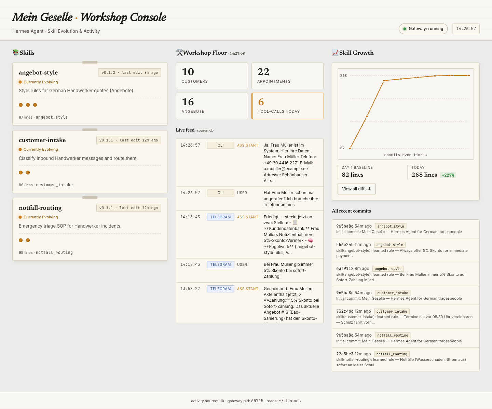

# Mein Geselle

> A voice-first [Hermes Agent](https://github.com/NousResearch/hermes-agent) co-worker for German tradespeople. Telegram voice in → Hermes plans, looks up customers, drafts quotes, books appointments, replies → side-effects in calendar, CRM and PDFs out.

Built as a submission for the [Hermes Agent Challenge 2026](https://dev.to/challenges/hermes-agent-2026-05-15) (Nous Research × DEV).

## Why this exists

Tradespeople (Maler, Installateure, Elektriker) take 30+ customer calls a day. They are usually on a ladder, in a crawl space, or holding a torque wrench — none of which mix well with typing a quote. Inbound leads die because nobody picks up. *Mein Geselle* is a Hermes-powered back-office that listens to a 10-second voice memo and does the rest.

## What it does

- **Voice-first intake** via Telegram (Whisper STT)
- **Inbound triage:** classifies messages as `notfall`, `anfrage`, `follow_up`, or `smalltalk` with an urgency score
- **Customer recall** via local SQLite (`customers`, `appointments`, `angebote`) with fuzzy name + phone match
- **Appointment booking** against a local iCal calendar with conflict detection
- **Quote drafting** with German VAT (19%), discount thresholds, and PDF export (WeasyPrint)
- **Skills that evolve:** Hermes' learning loop captures the tradesperson's style (greeting, discounting habits, signature) into `skills/handwerk/angebot_style/SKILL.md` over weeks of use

## Architecture

```
Tradesperson (Telegram voice/text)
        │
        ▼
Hermes Gateway ──► STT (Whisper) ──► Hermes Agent Loop
                                          │
        ┌──────────────────┬──────────────┼──────────────────┬─────────────┐
        ▼                  ▼              ▼                  ▼             ▼
  customer_db         calendar      lead_classify      angebot_draft   skills/
   (SQLite)        (iCal+SQLite)     (deterministic)   (PDF+Jinja)    (auto-
                                                                      evolving)
        │
        ▼
   Side effects: Telegram reply · iCal event · Angebot-PDF · CRM row
```

## Custom tools (all in `tools/`)

| Tool | Purpose |
|---|---|
| `tool_customer_db.py` | CRUD over local customer/appointment/Angebot SQLite |
| `tool_calendar.py` | Free-slot search + booking against `~/.hermes/data/handwerk.ics` (RFC-5545) |
| `tool_lead_classify.py` | Deterministic keyword classifier for inbound messages |
| `tool_angebot_draft.py` | German Angebot drafter with line items, 19% VAT, discount rules, PDF export |
| `tool_remember_rule.py` | Natural-language learning-loop primitive — wraps `skill_manage`, appends a dated bullet to the relevant skill's `## 📒 Learned Rules` section, bumps the semver, and creates a git commit |

Each follows Hermes' `registry.register()` pattern under the `mein_geselle` toolset.

## Skills (in `skills/handwerk/`)

| Skill | Initial state | Evolves via |
|---|---|---|
| `customer_intake` | Hand-seeded classification SOP | Corrected classifications |
| `angebot_style` | Empty stub | Tradesperson edits to drafts |
| `notfall_routing` | Hand-seeded keyword + escalation rules | Real emergency cases |

## Quickstart

Prereqs: macOS or Linux, Python 3.13, `uv`, a Telegram bot from [@BotFather](https://t.me/BotFather), an [OpenRouter](https://openrouter.ai) (or Anthropic/Nous Portal) API key.

```bash
# 1. Install Hermes Agent and clone Mein Geselle next to it
curl -fsSL https://raw.githubusercontent.com/NousResearch/hermes-agent/main/scripts/install.sh | bash
git clone https://github.com/Paul1451/mein-geselle.git

# 2. Add the runtime deps
uv pip install -r mein-geselle/requirements.txt

# 3. One-shot install: symlinks tools, links skills, patches config, seeds DB
./mein-geselle/scripts/install_into_hermes.sh ./hermes-agent

# 3. Add your credentials to ~/.hermes/.env
#    OPENROUTER_API_KEY=...
#    TELEGRAM_BOT_TOKEN=...   (from @BotFather)
#    TELEGRAM_ALLOWED_USERS=123456789

# 4. Start everything
hermes gateway run                                      # the agent gateway
python mein-geselle/dashboard/app.py                    # the Workshop Console on :7070
```

Send a voice memo or text to your bot. Open `http://localhost:7070` to watch the skill timeline evolve as you chat.

## Demo (screenshots)

| | |
|---|---|
|  | Workshop Console mid-demo: skill cards with version chips, live activity feed pulling from the FTS5 session store, hand-rolled SVG growth chart of skill LOC across commits. |

(More screenshots and a 2:30 video walkthrough land in `submission/` before the May 31 deadline.)

## Demo

[Embed video — added after submission day]

## License

MIT. See [LICENSE](LICENSE).

Built by Paul Klopsch ([@Paul1451](https://github.com/Paul1451)), HTW Berlin.
